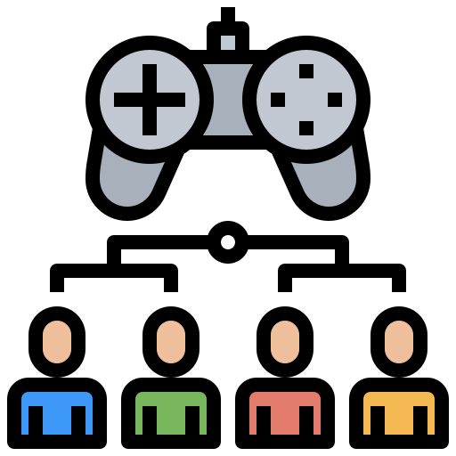
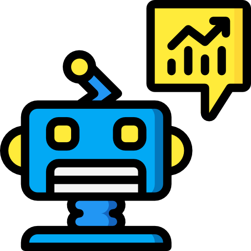
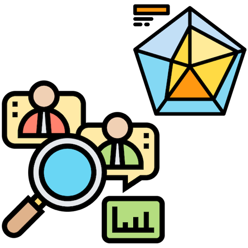
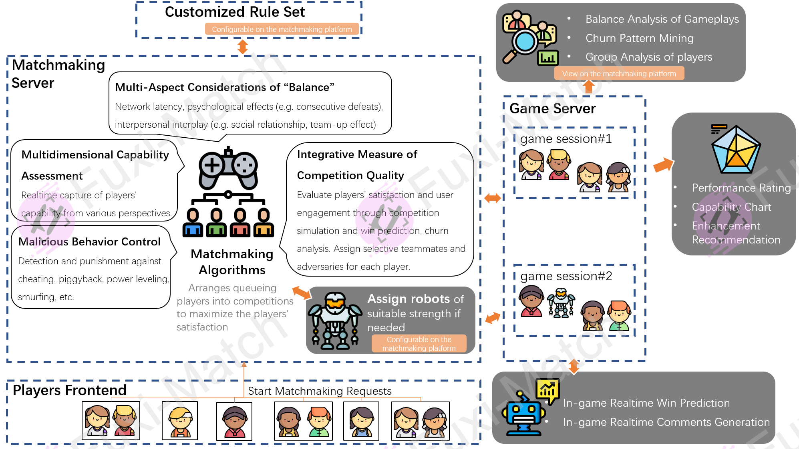

<!--
 * @
 * 
 * @Author: Linxia GONG 巩琳霞 (linxiagong@gmail.com)
 * @Date: 2020-12-23 21:04:48
 * @LastEditors: Linxia GONG 巩琳霞
 * @LastEditTime: 2020-12-24 16:04:13
-->
# Functionality

    

        
        
Pre-Game Matchmaking

    

    

        
        
In-Game Win-Prediction & Comments-Generation

    

    

        
        
Post-Game Analysis

    

## Pre-Game Matchmaking
> Matchmaking is the process of arranging queueing players into competitions.
>
> (i.e. decide who are going to be teammates and who are going to be adversaries)

**Fuxi Match** provides the AI-enhanced matchmaking services to maximize the gross players' satisfaction for upcoming matches.

AI algorithms are applied to 3 processes in a matchmaking system:
- User Modeling
- Arrival Modeling
- Online Planning

## In-Game Win-Prediction & Comments-Generation
- Realtime win prediction with the match going on
- Realtime comments generation to summarize the match and highlight the key actions/moments

## Post-Game Analysis
- Performance Rating
- Performance Radar Chart
- Piggybacking Detection
- Potential Cheating Diagnosis
- Power Leveling Detection
- Smurfing Detection

# Matchmaking SaaS

# Research & Blogs
### Papers
- <mark><em>Fuxi AI Lab</em></mark> 【KDD'20】 OptMatch: Optimized Matchmaking via Modeling the High-Order Interactions on the Arena &nbsp;&nbsp;&nbsp;[>>Blog & Code & Data](../OptMatch/)
- <mark><em>Fuxi AI Lab</em></mark> 【CIKM'20】Match Tracing: A Unified Framework for Real-time Win Prediction and Quantifiable Performance Evaluation &nbsp;&nbsp;&nbsp;>>Blog & Code & Data
- <mark><em>Reproduction</em></mark> 【WWW'17】EOMM: An Engagement Optimized Matchmaking &nbsp;[>>Blog & Code & Data](../EOMM/)

### Practical Tricks
- How to measure a win-prediction model in the matchmaking context

### Basics and Prerequisites
- ELO
- TrueSkill

